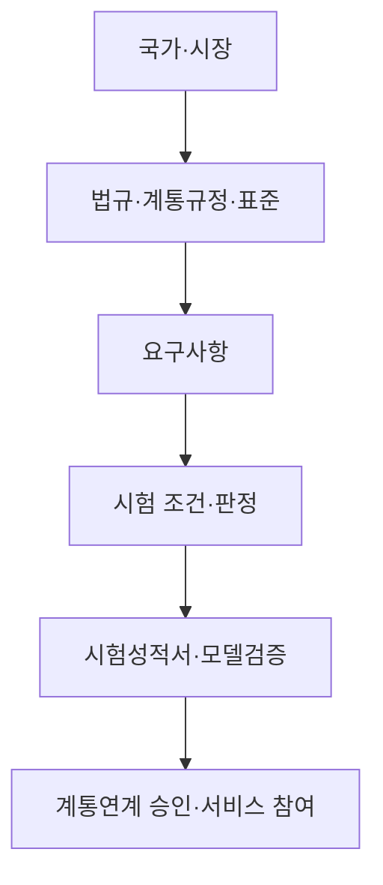

# GFM 세계 규격·시험·인증

대규모 BESS·PCS를 중심으로 국가/시장 → 제도 → 원문 → 요구사항 → 시험 → 증빙을 추적하는 공개 지식창고입니다. 제3자 원문은 복제하지 않고 공식 링크와 자체 작성한 한국어 요약을 제공합니다.

## 현재 스냅샷

| 구분 | 수량 | 해석 |
|---|---:|---|
| 국제 핵심 문서 노트 | 20 | 호주·영국·EU·독일·미국·중국 |
| 한국 공식 문서 노트 | 6 | KSGA 현행 표준, 정부 발표, KPX 시장규칙·세부운영규정·모델 제출안, KTL 시험서비스 |
| 한국 추적 항목 | 2 | KSGA 개정 준비, 한전 공청회·기준 수립 이력 |
| 공식 전문·페이지 확인 | 22 | 열람 가능과 재배포 가능은 별개 |
| 유료·접근 제한 | 4 | IEEE·중국 국가표준 등 |

## 한국 제도 트랙

| 트랙 | 현재 확인 상태 | 다음 확인점 |
|---|---|---|
| KSGA 단체표준 | `KSGA-025-18-1:2023 Ed1` 확정·공개 | 개정안의 공식 공개회람·심의 단계·판본 |
| 한전 계통연계기준 | 의견수렴을 거친 GFM BESS 성능요건 마련이 정부 발표로 확인됨 | 송·배전용 전기설비 이용규정의 정확한 개정 조항·시행본 |
| KPX 시장·모델 규칙 | 2026-04-29 시행 시장규칙 확인. 2026-02-23 공개 세부운영규정에는 GFM 항목 없음. 2026-08-25 모델 제출안은 잠정안 | GFM을 반영한 후속 세부운영규정·시험서식과 모델 제출안의 확정본 |
| 시험·제품 인증 | KTL이 KSGA-025-18-1 시험서비스와 2 MW 이하 가능 용량을 안내 | 인증규칙·KOLAS 인정범위·실제 증서 원장; 시험 안내만으로 인증 확정 금지 |

## 탐색

- [세계 지식창고 홈](00_Home/Home.md)
- [한국 GFM 허브](03_Regions/한국.md)
- [자료 확보 현황](00_Home/자료_확보_현황.md)
- [초기 요구사항·시험 비교](10_Comparisons/초기_요구사항_시험_비교.md)
- [한국 중앙계약 BESS 요구사항](06_Requirements/한국_GFM_BESS_요구사항_색인.md)
- [요구 → 시험 → 증빙 예제](10_Comparisons/요구_시험_증빙_연결_예제.md)
- [공개 설계와 로드맵](00_Home/공개_설계_및_로드맵.md)
- [저작권 정책](00_Home/COPYRIGHT_POLICY.md)

## 추적성 모델

‘요구가 유사함’은 ‘시험이 동등함’이나 ‘인증이 상호 인정됨’을 뜻하지 않습니다.
